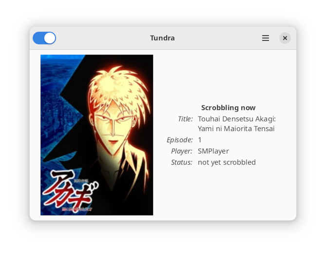

Tundra
======

[](https://github.com/m4tx/tundra/actions/workflows/rust.yml)
[](https://crates.io/crates/tundra)
[](https://docs.rs/tundra)
[](https://github.com/m4tx/tundra/blob/master/LICENSE)
[](https://codecov.io/gh/m4tx/tundra)
Tundra is an open-source MyAnimeList scrobbler application for Linux. It automatically detects media players running on your computer, checks for any anime videos playing, and marks them as watched on you MAL profile.



## Download

### Flatpak

<a href="https://flathub.org/apps/details/moe.tundra.Tundra"></a>

### AUR

For Arch Linux users, there are two packages in AUR to choose from:
* [aur/tundra](https://aur.archlinux.org/packages/tundra/) - stable version
* [aur/tundra-git](https://aur.archlinux.org/packages/tundra-git/) - latest git version

## Usage

### GUI

The usage is very simple:

1. First, you need to sign in to your MyAnimeList account with your MAL username and password.
2. Make sure that the title you are about to watch is marked as "watching" or "plan to watch" on your MAL account.
3. Then, you need to run an MPRIS-enabled media player and play a local anime video file. Its title, poster picture and episode number will appear after a few seconds in Tundra window.
4. The episode will be scrobbled after you watch over half of the video. You will know once you see the notification!

### CLI

Tundra has CLI interface as well. First, you need to authenticate:

```
tundra authenticate
```

This will display a URL which you will need to open and then sign in to your MyAnimeList account. Then, you can run Tundra as a daemon:

```
tundra daemon
```

This way, Tundra will periodically check for players running and scrobble any anime videos to your MAL account, just like the GUI version.

## Building

### Requirements

* [Rust stable](https://www.rust-lang.org/)
* D-Bus
* libnotify
* GTK 4
* libadwaita
* gettext

### How to build

Make sure you have executed `git clone --recursive`, so the submodules are cloned as well. Tundra uses [*Cargo*](https://doc.rust-lang.org/cargo/) as its package manager and build system. It can be built by executing `cargo build` in the project root directory. For the release version, execute `cargo build --release`.

### Flatpak

After you have installed [*Flatpak Builder*](https://docs.flatpak.org/en/latest/flatpak-builder.html) execute `flatpak-builder --install repo moe.tundra.Tundra.json --force-clean --user -y` in the project root directory to build and install the Flatpak package.

Flathub repo can be found here: [flathub/moe.tundra.Tundra](https://github.com/flathub/moe.tundra.Tundra).

### `pre-commit`

We encourage contributors to use predefined [`pre-commit`](https://pre-commit.com/) hooks — to install them in your local repo, make sure you have `pre-commit` installed and run:

## Localization

Tundra translation is being done on the Transifex platform. See the [Tundra project on Transifex](https://app.transifex.com/tundra/) webpage if you would like to contribute a translation for a language you know.

Currently offered languages:
* English
* Japanese
* Polish

```shell
pre-commit install
```

## Related projects

* [Taiga](https://github.com/erengy/taiga)
* [Anime Relations](https://github.com/erengy/anime-relations)
* [Anitomy](https://github.com/erengy/anitomy)
* [MyAnimeList Unofficial API Specification](https://github.com/SuperMarcus/myanimelist-api-specification)
